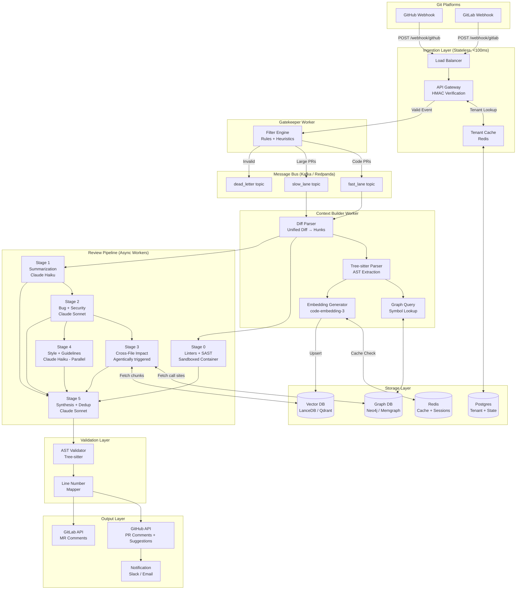
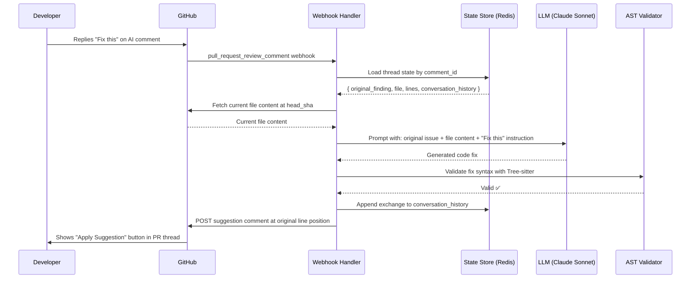

# Building an AI Code Reviewer: Complete Architecture Deep Dive
### A Production-Grade Blueprint for an Open-Source CodeRabbit Clone

---

## 🧭 Table of Contents

1. [Ingestion & Webhook Layer](#1-ingestion--webhook-layer)
2. [Context Construction — The RAG Engine](#2-context-construction--the-rag-engine)
3. [The Diff Processing Pipeline](#3-the-diff-processing-pipeline)
4. [LLM Orchestration & Agentic Workflow](#4-llm-orchestration--agentic-workflow)
5. [State Management & Memory](#5-state-management--memory)
6. [Scalability & Cost Control](#6-scalability--cost-control)
7. [Infrastructure Diagram (Mermaid.js)](#7-infrastructure-diagram)
8. [Tech Stack Recommendations](#8-recommended-tech-stack)
9. [Relevant Articles & Resources](#9-relevant-articles--resources)

---

## 1. Ingestion & Webhook Layer

### 1.1 The Core Problem

GitHub/GitLab webhooks expect a **200 OK response within 10 seconds**. But a quality AI review takes **60–120 seconds**. If you process synchronously, GitHub retries. Retries spike load. Spikes crash your server. The naive architecture fails in production within hours of any meaningful traffic.

The second problem is **multi-tenancy**: each customer's repository belongs to a different GitHub App installation, has its own billing tier, different configurations, and potentially different LLM settings.

### 1.2 The Stateless Gateway Pattern

Your ingestion layer must be a **dumb, fast, stateless HTTP receiver**. It does exactly three things and nothing more:

**Step 1 — Verify the HMAC Signature**
Every GitHub/GitLab webhook POST includes a header (`X-Hub-Signature-256`) that is an HMAC-SHA256 of the payload body using a shared secret. Verify this **before** any database lookup. Drop the request immediately with `403` if it fails. This is your first line of defense against replay attacks and spam.

```python
import hmac, hashlib

def verify_github_signature(payload_body: bytes, secret: str, signature_header: str) -> bool:
    expected = "sha256=" + hmac.new(
        secret.encode(), payload_body, hashlib.sha256
    ).hexdigest()
    return hmac.compare_digest(expected, signature_header)
```

**Step 2 — Tenant Lookup & Billing Check**
Map the `installation_id` in the payload to a tenant record. Confirm the subscription is active. This should be a Redis cache lookup (~1ms), not a Postgres query. If the tenant is over their PR quota, enqueue a "quota exceeded" notification, but still return 200 to avoid GitHub disabling your webhook.

**Step 3 — Enqueue & Return 200**
Serialize the raw webhook payload with tenant metadata and push it to a durable queue. Return `200 OK` immediately. The entire handler should complete in under 100ms.

### 1.3 Queue Architecture: Kafka vs. SQS vs. Google Cloud Tasks

The real CodeRabbit uses **Google Cloud Tasks** backed by Cloud Run services, as confirmed by their Google Cloud engineering blog. For an open-source version, you have three viable choices:

| Queue | Best For | Replay | Ordering |
|-------|----------|--------|----------|
| **Kafka / Redpanda** | High volume, on-prem, replay-ability | ✅ Yes | Per-partition |
| **AWS SQS + FIFO** | AWS-native, low ops overhead | ❌ No replay | Per message group |
| **Redis Streams** | Simple, self-hosted, good performance | ✅ Limited | Per stream |

For a self-hosted open-source project, **Redpanda** (Kafka-compatible, single binary, no ZooKeeper) is ideal. It gives you ordered, partitioned, replayable events. If a worker crashes mid-review, another worker picks up the exact event from the last committed offset — no data loss.

**Partition your Kafka topics by `tenant_id`** so that all events from one organization are processed in order. This prevents race conditions where two PRs from the same repo run simultaneously.

### 1.4 The Gatekeeper: Pre-LLM Filtering

Before events even reach the AI pipeline, a cheap **Rules Engine** worker should filter noise. In practice, roughly 65% of all webhook events should be dropped or downgraded before any LLM is involved:

```
Incoming Events
├── Bot PRs (Dependabot, Renovate) → DROP (unless security scan is enabled)
├── Documentation-only changes (.md, .rst, .txt only) → DROP or SUMMARIZE-ONLY
├── Lockfiles only (package-lock.json, yarn.lock) → DROP
├── Draft PRs → HOLD (enqueue, process when ready)
├── Large PRs (>50 changed files) → SLOW_LANE queue
└── Normal code PRs → FAST_LANE queue
```

Lane routing is critical. One massive monorepo PR should never block 50 small PRs from other tenants. Use separate consumer groups for `fast_lane` and `slow_lane` topics.

### 1.5 Initial Indexing vs. Incremental PR Updates

These are fundamentally different workflows that share some infrastructure but diverge significantly in scope and strategy.

**Initial Indexing (New Repository Install)**

When a user first connects their repository, you need to index the entire codebase. This is a **batch job**, not a real-time job. The flow:

1. Clone the repository to ephemeral storage (a short-lived container or volume)
2. Walk the file tree, filtering out binaries, generated files, vendored code
3. For each code file: parse it with Tree-sitter to extract symbols (functions, classes, imports, exports)
4. Chunk the files by logical unit (function/class boundary, not fixed token size)
5. Generate embeddings for each chunk using a code-specific embedding model (e.g., `text-embedding-3-large` or `CodeSage`)
6. Upsert into the vector database, tagged with `repo_id`, `file_path`, `commit_sha`, `chunk_type`
7. Build a **code graph** in a graph database (Neo4j or in-memory): nodes are symbols, edges are "calls", "imports", "extends"

This job is rate-limited and runs asynchronously. You notify the user when indexing is complete. Large repos (millions of lines) may take 5–20 minutes.

**Incremental PR Updates**

When a PR is opened or updated, you only process the **delta**. The flow:

1. Fetch the PR diff from the GitHub/GitLab API
2. For each changed file, identify which **chunks** (functions/classes) were modified
3. Re-embed only the modified chunks and upsert them (the rest of the repo index is already current)
4. Update the code graph edges for any changed symbol relationships
5. Proceed to diff analysis

The key insight is that ~95% of the repository index is already valid. You only re-embed the changed chunks, which keeps embedding costs negligible for most PRs.

---

## 2. Context Construction — The RAG Engine

### 2.1 Why Naive RAG Fails for Code

Standard RAG (chunk text → embed → retrieve by similarity) was designed for documents. Code is fundamentally different: it has **explicit dependency graphs**. A diff that changes `getUserById(id: string)` to `getUserById(id: UUID)` looks like a small change in isolation, but it breaks every call site in the entire repository. A vector similarity search won't find these call sites because the callers don't semantically resemble the definition.

You need **GraphRAG** — retrieval that understands structural relationships, not just semantic similarity.

### 2.2 Code Chunking Strategy

Never chunk code by token count alone. The correct chunking hierarchy, from most to least preferred:

**Level 1 — Semantic Boundaries (ideal)**
Use **Tree-sitter** to parse the AST and extract complete functions, methods, or classes as chunks. A function is the natural unit of code review. Tree-sitter supports 100+ languages and runs in milliseconds.

```python
import tree_sitter_python as tspython
from tree_sitter import Language, Parser

PY_LANGUAGE = Language(tspython.language())
parser = Parser(PY_LANGUAGE)

def extract_function_chunks(source_code: str) -> list[dict]:
    tree = parser.parse(source_code.encode())
    chunks = []
    for node in tree.root_node.children:
        if node.type in ('function_definition', 'class_definition'):
            chunks.append({
                'content': source_code[node.start_byte:node.end_byte],
                'start_line': node.start_point[0],
                'end_line': node.end_point[0],
                'type': node.type,
                'name': node.child_by_field_name('name').text.decode()
            })
    return chunks
```

**Level 2 — Sliding Window with Overlap (fallback)**
For languages Tree-sitter handles poorly, or for very long files, use a 512-token window with 128-token overlap. The overlap preserves context across chunk boundaries.

**Level 3 — File-level (last resort)**
For config files, small scripts, or non-parseable formats.

### 2.3 The Symbol Graph: Solving Cross-File Dependencies

This is the most architecturally important component. Build and maintain a **symbol relationship graph** alongside your vector index:

**Nodes:** Every exported function, class, interface, type, constant
**Edges:** `CALLS`, `IMPORTS`, `EXTENDS`, `IMPLEMENTS`, `USES_TYPE`

When a PR modifies a function signature, your system executes a **graph traversal query**:

```cypher
// Neo4j Cypher: Find all callers of a changed function
MATCH (changed:Symbol {name: "getUserById", repo: "myrepo"})
<-[:CALLS]-(caller:Symbol)
RETURN caller.file_path, caller.start_line, caller.name
```

This instantly retrieves every call site across the entire repository. You then fetch those chunks from the vector DB (or directly from the repo) and include them in the LLM context alongside the diff.

**Building the graph during indexing** requires a language-specific reference resolver. Tree-sitter gives you the AST; resolving that a call to `getUserById` in `controllers/user.ts` refers to the `getUserById` export in `services/user.ts` requires tracking import statements. For TypeScript/JavaScript, this is straightforward. For dynamically-typed languages like Python, you use heuristics (match function names + import paths).

### 2.4 The Full Context Pipeline for a PR

When a PR arrives, the Context Builder worker assembles a rich context packet:

```
Context Packet
├── 1. PR Metadata: title, description, linked issue (if Jira/Linear integration enabled)
├── 2. The Git Diff (raw hunks)
├── 3. Expanded Changed Files (full file content, not just diff lines)
├── 4. Call Site Context (from graph traversal for changed signatures)
├── 5. Similar Past Reviews (vector similarity: "have we reviewed code like this before?")
├── 6. Custom Instructions (from .coderabbit.yaml or equivalent config file)
└── 7. Linter/SAST Results (run 40+ static analyzers, pre-filter false positives)
```

The **ordering** of this context in the prompt matters. Place the most relevant information (the diff, the changed function's call sites) nearest to the query in the prompt. This is the "lost in the middle" mitigation strategy — LLMs attend better to content at the beginning and end of long contexts.

---

## 3. The Diff Processing Pipeline

### 3.1 Parsing the Unified Diff Format

A raw Git diff is a sequence of **hunks**. Each hunk has a header `@@ -L,N +L,N @@` indicating the starting line and number of lines in the old and new file. Your diff parser needs to:

1. Parse the unified diff into structured hunk objects
2. Track absolute line numbers in the new file (for placing PR comments at the correct line)
3. Group hunks by file

```python
@dataclass
class DiffHunk:
    old_start: int
    old_count: int
    new_start: int
    new_count: int
    context_lines: list[str]  # unchanged lines for context
    removed_lines: list[tuple[int, str]]  # (line_no, content)
    added_lines: list[tuple[int, str]]   # (line_no, content)
    function_context: str | None  # from AST: which function does this hunk belong to?
```

### 3.2 Hunk-Level Analysis vs. File-Level Analysis

These serve different purposes and should be used in combination:

**Hunk-Level Analysis** is precise and cheap. Each hunk is analyzed in isolation with 3–5 lines of surrounding context. This catches: off-by-one errors, null pointer risks, logic bugs in the changed lines. The prompt is small (~500 tokens), which means you can run many hunks in parallel. Use a cheaper/faster model here (GPT-4o-mini, Claude Haiku).

**File-Level Analysis** is holistic and expensive. The entire file (pre and post change) is analyzed together. This catches: architectural drift, function doing too many things, broken invariants that span multiple hunks. Reserve this for files with >3 hunks changed or files deemed "critical" (e.g., auth modules, payment handlers). Use a more capable model here.

**The Decision Logic:**
```
For each changed file:
  if hunk_count == 1 and file_size < 200_lines:
    → HUNK_LEVEL only (fast, cheap)
  elif hunk_count <= 3:
    → HUNK_LEVEL + brief FILE_LEVEL summary
  else:
    → FILE_LEVEL primary + hunk-level for specific deep dives
  
  if file matches critical_patterns (auth, payment, crypto):
    → Always FILE_LEVEL regardless
```

### 3.3 Line Number Mapping for Accurate Comments

This is a common source of bugs. GitHub's Pull Request Review API requires a `position` parameter (the line's position within the diff, counting from 1) rather than an absolute line number. But your LLM generates comments referencing lines in the new file.

The mapping requires walking the diff:

```python
def build_line_to_position_map(diff_text: str) -> dict[int, int]:
    """
    Returns: { new_file_line_number: diff_position }
    """
    position = 0
    new_line = 0
    line_map = {}
    
    for line in diff_text.split('\n'):
        if line.startswith('@@'):
            # Parse @@ -old_start,old_count +new_start,new_count @@
            match = re.search(r'\+(\d+)', line)
            new_line = int(match.group(1)) - 1
            position += 1
        elif line.startswith('+'):
            new_line += 1
            position += 1
            line_map[new_line] = position
        elif line.startswith('-'):
            position += 1
            # Removed lines have no new_line mapping
        else:  # context line
            new_line += 1
            position += 1
            line_map[new_line] = position
    
    return line_map
```

For **multi-line suggestions** (GitHub's `suggestion` block spanning multiple lines), you specify `start_line` and `line` in the comment body, and both must map to valid positions within the same diff hunk. Validate this before posting — GitHub rejects comments where the line range crosses a hunk boundary.

---

## 4. LLM Orchestration & Agentic Workflow

### 4.1 The Hybrid Pipeline: Not Fully Agentic, Not Fully Fixed

CodeRabbit's own engineering blog describes their architecture as a **hybrid** — combining the determinism of fixed pipelines with targeted agentic flexibility. A pure agent loop (give the LLM tools and let it decide everything) is too unpredictable and expensive for production code review. A pure fixed pipeline misses issues that require multi-step reasoning.

The right architecture is a **staged pipeline with agentic escalation**:

### 4.2 The Multi-Stage Review Pipeline

**Stage 0: Static Analysis (Pre-LLM, ~0 cost)**
Run all linters and SAST tools in a sandboxed container. Collect results. This is deterministic and fast. Tools: ESLint, Semgrep, Bandit, Trivy, Checkov, Gitleaks (for secret detection). Feed these results into the LLM context so it can de-duplicate and contextualize — the LLM decides which linter warnings are worth surfacing vs. noise.

**Stage 1: Summarization (~300 tokens output)**
Prompt: "Given this diff and PR description, summarize what this PR does and why." This summary is used in two ways: (1) it's posted as the PR overview comment, and (2) it's prepended to all subsequent stage prompts for cross-file coherence.

**Stage 2: Bug & Security Detection (per-file or per-hunk)**
This is the most critical stage. Prompt focuses specifically on: null/undefined risks, race conditions, off-by-one errors, SQL injection, auth bypass, TOCTOU vulnerabilities, and broken error handling. Run file-level analysis here.

**Stage 3: Cross-File Impact Analysis (agentic escalation)**
After Stage 2, if the system detects that a changed symbol is referenced across files (via the code graph query), it **dynamically fetches** those call sites and runs an additional LLM call asking: "Does the change in [file A] break the usage in [file B]?" This is where the agentic capability lives — the system decides at runtime whether to fetch more context.

**Stage 4: Style & Best Practices (hunk-level, parallelized)**
Run cheaply in parallel on each hunk. Uses a faster/cheaper model. Checks: naming conventions, code duplication, function length, custom guidelines from `.coderabbit.yaml`.

**Stage 5: Synthesis & Deduplication**
Collect all findings from Stages 0–4. Run a final LLM pass: "Given all these potential issues, which are real, which are duplicates, which are false positives? Return only actionable findings with severity ratings." This is critical for noise control.

### 4.3 Hallucination Mitigation via AST Validation

This is one of the most important reliability techniques. LLMs will sometimes suggest that a function exists, reference a line number incorrectly, or claim a variable is undefined when it isn't.

**Technique 1: AST-Based Code Suggestion Validation**
Before posting any LLM-generated code suggestion, parse it with Tree-sitter. If it's syntactically invalid, discard the suggestion and post only the textual comment. Never post broken code suggestions.

```python
def validate_code_suggestion(code: str, language: str) -> bool:
    parser = get_parser(language)
    tree = parser.parse(code.encode())
    # Tree-sitter marks syntax errors with ERROR nodes
    return not any(node.type == 'ERROR' for node in traverse(tree.root_node))
```

**Technique 2: Line Number Grounding**
When the LLM references a specific line number, verify that the line exists in the diff and that the content matches what the LLM claims. If it says "line 42 has a null dereference" but line 42 in your diff map is `}`, reject that finding.

**Technique 3: Existence Verification for Symbol Claims**
If the LLM says "function `processPayment` doesn't handle the case where `amount` is zero", query your symbol graph to confirm `processPayment` actually exists in the codebase before posting. This prevents ghost-function hallucinations.

**Technique 4: Self-Consistency Sampling**
For high-severity findings (security vulnerabilities), run the detection prompt twice with `temperature=0.3`. If both runs identify the same issue, it's likely real. If only one does, flag for lower confidence or suppress.

---

## 5. State Management & Memory

### 5.1 Conversation State Within a PR Thread

When a developer replies to an AI comment with "Fix this" or "Can you explain why?", the system needs context about which comment is being replied to, the original review context, and any previous conversation turns.

Each PR thread should be treated as a **conversation session** with the following state stored in your database:

```json
{
  "session_id": "pr_12345_thread_7",
  "pr_metadata": { "repo": "...", "pr_number": 12345, "base_sha": "...", "head_sha": "..." },
  "original_finding": {
    "file": "src/auth/login.ts",
    "line": 47,
    "hunk_context": "...",
    "finding_text": "This token comparison is vulnerable to timing attacks.",
    "suggestion": "Use crypto.timingSafeEqual() instead."
  },
  "conversation_history": [
    { "role": "assistant", "content": "This token comparison is vulnerable..." },
    { "role": "user", "content": "Fix this" }
  ]
}
```

When a webhook fires for a PR comment (`pull_request_review_comment` event), you look up the thread state, reconstruct the full context, and run a new LLM call with the conversation history appended.

### 5.2 The "Fix This" → Commit Suggestion Flow

When a developer says "Fix this" to an AI comment, the system should generate a **committable code suggestion** using GitHub's suggestion markdown format:

```markdown
```suggestion
const isValid = crypto.timingSafeEqual(
  Buffer.from(providedToken),
  Buffer.from(storedToken)
);
```
```

This renders as a one-click "Apply suggestion" button in the GitHub UI. The flow:

1. Receive the "Fix this" comment reply webhook
2. Load thread state: which file, which lines, what was the issue
3. Fetch the current file content at `head_sha` (not the cached version — the PR may have been updated)
4. Construct prompt: "You previously flagged [issue]. The developer asked you to fix it. Provide a corrected version of lines [X–Y] only."
5. Parse the LLM response, extract the code block
6. Validate it with Tree-sitter (syntax check)
7. Format as a GitHub suggestion comment with `start_line` and `line` parameters
8. Post via GitHub API

**For larger fixes** that span multiple hunks or files, the system cannot use GitHub suggestion blocks. Instead, it should post a structured explanation with a full code snippet and optionally open a Jira/Linear ticket, or (for advanced implementations) use the GitHub API to create a new branch and PR with the fix applied programmatically.

### 5.3 Persistent Learning / Organizational Memory

For long-term quality improvement, store review outcomes in a vector database keyed by `(org_id, finding_type)`:

- When a developer thumbs-down a comment, embed that finding with a "noise" label
- When a developer applies a suggestion, embed it with a "signal" label
- At retrieval time, use these learned examples as few-shot examples in your prompts: "Here are examples of real issues vs. false positives for this team"

This is what CodeRabbit calls "learnings" — the system gets smarter about what each team cares about over time.

---

## 6. Scalability & Cost Control

### 6.1 The Cost Problem at Scale

Consider: 10,000 PRs/day × average 500 changed lines × ~$0.01/1K tokens at GPT-4o pricing = **thousands of dollars per day** if you send everything through the most expensive model. Cost control is not an optimization — it's a survival requirement.

### 6.2 The Model Cascade (SLM → LLM)

The most impactful cost optimization is a **model cascade**: use cheap/fast models for most work and escalate to expensive models only when necessary.

```
Tier 1: Rules Engine (free)
  → Handles: bot detection, file type filtering, lockfile changes
  → Cost: $0

Tier 2: Small Language Model / Embedding Model (~$0.0001/call)
  → Handles: "Is this diff complex enough to need detailed review?"
  → Model: A fine-tuned classifier, or GPT-4o-mini with a binary prompt
  → Decision: Route to Tier 3 (detailed review) or Tier 4 (summary only)

Tier 3: Mid-tier LLM (Claude Haiku, GPT-4o-mini)
  → Handles: Hunk-level style and basic bug analysis (~80% of all hunks)
  → Cost: ~10x cheaper than flagship models

Tier 4: Flagship LLM (Claude Sonnet, GPT-4o)
  → Handles: Complex logic analysis, security audit, cross-file impact
  → Triggered by: High complexity score, security-sensitive files, >5 hunks changed

Tier 5: Specialized Reasoning Model (Claude Opus, o3)
  → Handles: Cryptographic code review, race condition analysis, architectural assessment
  → Triggered by: Explicit "deep review" request, or critical file patterns matched
```

### 6.3 Embedding Cache Strategy

Embeddings are deterministic — the same code chunk will always produce the same embedding. Cache aggressively:

**Cache Key:** `SHA256(chunk_content + model_name)`
**Cache Store:** Redis with TTL of 30 days
**Hit Rate:** For a typical monorepo, 70–90% of files are unchanged between PRs, meaning 70–90% of embeddings are cache hits

This alone can reduce embedding API costs by 80%.

### 6.4 Caching at the Review Level

Beyond embeddings, cache complete review outputs for identical diffs:

- If a developer closes and reopens a PR without changes, serve the cached review
- If two PRs in the same org change the same file in the same way (e.g., a mass-rename), generate the review once

**Cache Key:** `SHA256(repo_id + base_sha + head_sha + file_path)`
**TTL:** 24 hours (PRs change often)

### 6.5 Request Batching & Parallel Execution

Never process file hunks sequentially. The review pipeline should:

1. Parse all hunks and build the context packet (sequential — data dependency)
2. Fan out: dispatch all hunk-level prompts simultaneously (parallel LLM calls)
3. Wait for all completions (with a timeout — abandon straggler calls after 90s)
4. Run the synthesis stage on all results (sequential — depends on step 2)

Using Python: `asyncio.gather()` with a semaphore to limit concurrent LLM calls to your API rate limit.

### 6.6 Sandboxed Execution for Code Generation Validation

Like CodeRabbit, run linters and AI-generated scripts in **isolated containers** (Docker with cgroups, or microVMs via gVisor/Firecracker). Never execute LLM-generated code in your main application process. Each review gets an ephemeral sandbox that is destroyed after the review completes.

---

## 7. Infrastructure Diagram

### 7.1 Complete System Flow



### 7.2 Conversation Reply Flow



---

## 8. Recommended Tech Stack

### Core Services

| Component | Recommended Choice | Rationale |
|-----------|-------------------|-----------|
| API Gateway | FastAPI + Uvicorn | Async-native, fast, Python ecosystem |
| Message Queue | Redpanda | Kafka-compatible, single binary, no ZooKeeper |
| Task Workers | Celery + Redis OR Dramatiq | Mature, battle-tested, easy retry logic |
| Code Parsing | Tree-sitter | 100+ languages, fast, AST-accurate |
| Vector Database | LanceDB (embedded) or Qdrant | LanceDB used by CodeRabbit; Qdrant for separate service |
| Graph Database | Memgraph or Neo4j Community | Cypher-compatible; Memgraph is faster for real-time |
| Primary Database | PostgreSQL | Tenant data, PR state, review history |
| Cache | Redis | Embedding cache, session state, rate limiting |
| Container Runtime | Docker + gVisor | Sandboxed linter execution |
| Embedding Model | text-embedding-3-large or CodeSage | Code-specific embeddings outperform general ones |
| LLM (cheap tier) | Claude Haiku 3.5 or GPT-4o-mini | Fast, cheap, good for hunk-level analysis |
| LLM (main tier) | Claude Sonnet 4.5 or GPT-4o | Balance of quality and cost |
| LLM (deep tier) | Claude Opus 4 or o3 | Critical security analysis only |
| Observability | OpenTelemetry + Grafana | Trace every LLM call, measure latency and cost |

### Infrastructure

- **Containerization:** Docker + Kubernetes (or Cloud Run for simpler deployments)
- **IaC:** Terraform or Pulumi
- **CI/CD for the reviewer itself:** GitHub Actions
- **Secret Management:** Vault or AWS Secrets Manager

---

## 9. Relevant Articles & Resources

### Official Engineering Content
- **CodeRabbit on Google Cloud Run** (Google Cloud Blog, April 2025): How CodeRabbit built their sandboxed execution environment with Cloud Run, Jailkit, and cgroups. Directly details their real production architecture.
  URL: `https://cloud.google.com/blog/products/ai-machine-learning/how-coderabbit-built-its-ai-code-review-agent-with-google-cloud-run`

- **CodeRabbit + LanceDB Case Study** (LanceDB Blog, Sep 2025): Details their context engineering pipeline, how they use vector search, and why they migrated from a closed-source DB to LanceDB for cost and scale.
  URL: `https://lancedb.com/blog/case-study-coderabbit/`

- **Pipeline AI vs. Agentic AI for Code Reviews** (CodeRabbit Blog): Their own engineering team explains the hybrid architecture decision — why they didn't go fully agentic.
  URL: `https://www.coderabbit.ai/blog/pipeline-ai-vs-agentic-ai-for-code-reviews-let-the-model-reason-within-reason`

- **How CodeRabbit Delivers Reviews on Massive Codebases** (CodeRabbit Blog): Explains the isolated worker model, selective scope, and elastic scaling strategy.
  URL: `https://www.coderabbit.ai/blog/how-coderabbit-delivers-accurate-ai-code-reviews-on-massive-codebases`

### Architecture Deep Dives
- **Architecting a CodeRabbit-like Agent at Scale** (learnwithparam.com, Nov 2025): Excellent independent technical breakdown of the Event Storm, Buffer Pattern, Gatekeeper, and GraphRAG patterns.
  URL: `https://learnwithparam.com/blog/architecting-coderabbit-ai-agent-at-scale`

### Open-Source Projects to Study
- **PR-Agent (Codium/Qodo)** — Most mature open-source AI PR reviewer. Study its architecture before building your own.
  URL: `https://github.com/Codium-ai/pr-agent`

- **Kodus AI** — Open-source reviewer with AST-based structural analysis and multi-language support.
  URL: `https://github.com/kodustech/kodus-ai`

- **Metis (Arm Security)** — Open-source security-focused code reviewer using RAG.
  URL: `https://github.com/arm-security/metis` (search GitHub for latest)

### Foundational Technical Papers & Docs
- **Tree-sitter Documentation** — Essential for AST-based code parsing across 100+ languages.
  URL: `https://tree-sitter.github.io/tree-sitter/`

- **LangGraph** (LangChain) — For implementing the multi-stage agentic pipeline with state machines and conditional routing.
  URL: `https://langchain-ai.github.io/langgraph/`

- **Qdrant Documentation** — Production vector database with built-in payload filtering useful for per-tenant isolation.
  URL: `https://qdrant.tech/documentation/`

- **GitHub REST API: Pull Request Reviews** — The exact API you'll use to post comments and suggestions.
  URL: `https://docs.github.com/en/rest/pulls/reviews`

---

## 🚀 Suggested Build Order

If you're building this open-source from scratch, here's the sequence that minimizes wasted effort:

**Phase 1 — MVP (Weeks 1–4)**
Get a working GitHub App that posts basic LLM reviews on PRs. Single-file analysis only. No RAG, no graph. Ship something users can install.

**Phase 2 — Quality (Weeks 5–8)**
Add Tree-sitter parsing, proper hunk-level analysis, line number mapping for accurate comment placement, and the multi-stage pipeline (summarization → bug detection → style).

**Phase 3 — Context (Weeks 9–14)**
Add the vector database, embedding pipeline, and initial repository indexing. Now reviews are codebase-aware, not just diff-aware.

**Phase 4 — Intelligence (Weeks 15–20)**
Build the symbol graph, cross-file impact analysis, conversation state, and the "Fix this" suggestion flow.

**Phase 5 — Scale (Weeks 21+)**
Add the model cascade, embedding cache, multi-tenant lane routing, and observability. Open-source the result.

---

*This document was compiled from CodeRabbit's official engineering blog, Google Cloud's case study on CodeRabbit's architecture, the LanceDB case study, and independent system design analysis.*
